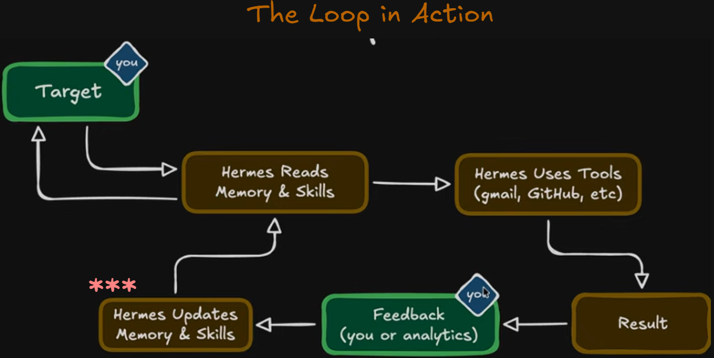

# Hermes Agent Workshop

This workshop teaches Hermes Agent with CLI/TUI Desktop and Dashboard.

## Start here

Read the files in this order:

1. [Getting Started](workshop/01-getting-started.md)
2. [Desktop](workshop/02-desktop.md)
3. [Dashboard](workshop/03-dashboard.md)

## Optional topics

4. [Profiles](workshop/04-profiles.md)
5. [Delegation](workshop/05-delegation.md)
6. [Kanban](workshop/06-kanban.md)
7. [Cron](workshop/07-cron.md)

## Hermes Self-Improvement Loop

Hermes can improve its future work through a feedback loop:

1. You set a target.
2. Hermes reads its Memory and Skills.
3. Hermes uses tools to do the work.
4. You or analytics provide feedback.
5. Hermes can update its Memory and Skills for future tasks.

This is the key idea of Hermes: it can learn from repeated work and improve its workflows over time. Review important updates before you rely on them.

## Official docs

- https://hermes-agent.nousresearch.com/docs
